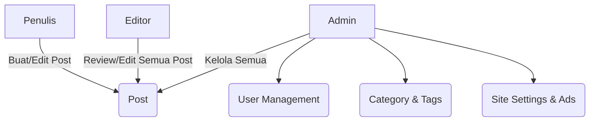
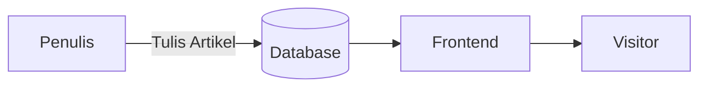
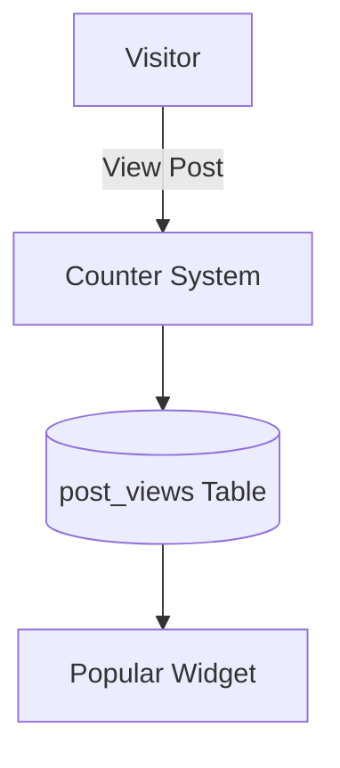
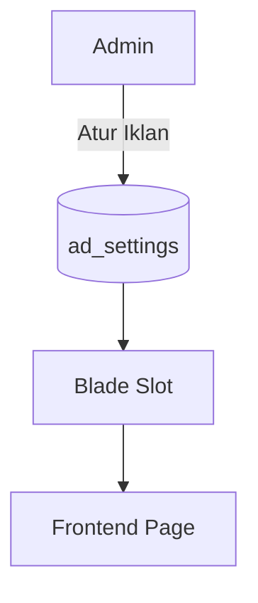
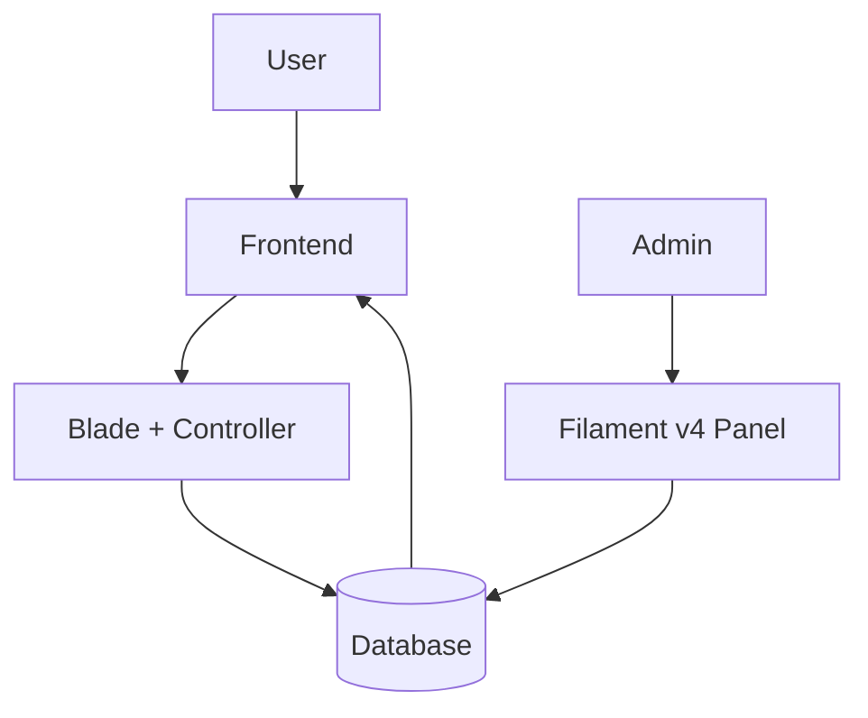

# 📖 Dokumentasi RCK News Management System

## 🏗️ Arsitektur Sistem
RCK News Management System dibangun menggunakan **Laravel 12** dan **Filament v4** sebagai admin panel.

### 🔹 Komponen Utama
- **Frontend**: Blade template + Tailwind CSS.
- **Backend**: Laravel 12, Eloquent ORM.
- **Admin Panel**: Filament v4 (untuk manajemen konten & pengaturan).
- **Database**: MySQL (mendukung relasi post, kategori, tags, user, ads).

---

## 🧑‍💻 Manajemen Role
Tiga level role utama:

- **Admin**
  - Mengelola semua data (post, kategori, user, iklan, setting).
  - Bisa mengedit post milik semua user.
- **Editor**
  - Mengelola post milik sendiri dan milik penulis lain.
  - Tidak bisa mengelola user.
- **Penulis**
  - Hanya bisa menulis & mengedit post miliknya.
  - Tidak bisa menghapus post user lain.

### 🔹 Alur Role


---

## 📰 Manajemen Post & Kategori
- Post memiliki relasi **kategori** dan **tags**.
- Post dapat difilter berdasarkan kategori/tag.
- URL post menggunakan format: `/tahun/bulan/slug`.

### 🔹 Alur Post


---

## 📊 Statistik & Popularitas
- Setiap view disimpan di tabel `post_views`.
- Tracking mencatat:
  - `post_id`
  - `user_id` (opsional)
  - `ip`
  - `session_id`
  - `viewed_at`

Digunakan untuk menampilkan artikel **populer harian, mingguan, bulanan**.

### 🔹 Alur Tracking


---

## 🎯 Pengaturan Iklan
Tabel `ad_settings` menyimpan pengaturan iklan berdasarkan posisi:
- `header_html`
- `sidebar_html`
- `below_post_html`
- `footer_html`

### 🔹 Alur Iklan


---

## ⚙️ Site Settings
- Identitas situs (logo, nama, deskripsi).
- Media sosial (Facebook, Instagram, YouTube, TikTok).
- SEO title & description default.

---

## 🎨 Frontend
### 🔹 Fitur
- **Home Page**: Hero slider + list berita terbaru & populer.
- **Kategori**: List post per kategori (scroll horizontal).
- **Post Page**: 
  - Judul, meta (tanggal, kategori), thumbnail, isi berita.
  - Tags, share button, artikel terkait.
  - Sidebar berisi artikel populer & terbaru.
- **Responsive**: Mobile & desktop.

---

## 🔐 Autentikasi
- Menggunakan Laravel Breeze / Fortify.
- Mendukung **login & registrasi user** dengan role tertentu.

---

## 📂 Struktur Utama Project
```
app/
 ├── Models/        # Post, Category, Tag, AdSetting, User
 ├── Http/Controllers
 ├── Policies/      # UserPolicy, PostPolicy
 └── Filament/      # Resource & Pages untuk Admin Panel

resources/views/
 ├── layouts/       # Layout utama
 ├── post/          # show.blade.php
 ├── components/    # ad-slot.blade.php
 └── home.blade.php # Halaman depan

database/migrations/
 ├── create_posts_table.php
 ├── create_categories_table.php
 ├── create_post_views_table.php
 └── create_ad_settings_table.php
```

---

## 🚀 Alur Umum Aplikasi


---

## 📘 Dokumentasi Singkat
- **Menambahkan Post Baru**: Admin/Editor/Penulis → Panel Filament → Posts → Create.
- **Mengatur Iklan**: Admin → Filament → Pengaturan Iklan → Isi script HTML.
- **Melihat Statistik**: Otomatis dari `post_views`.
- **SEO**: Diset otomatis di `PostController` dengan `SEOTools`.

---

✍️ **Author**: Tim PT. ROEMAH CITA KREATIF  
📅 **Versi**: 1.0.0  
